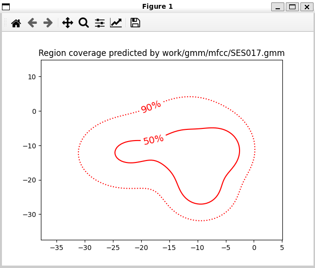
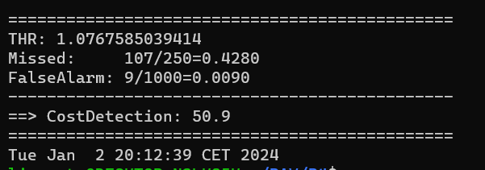

PAV - P4: reconocimiento y verificación del locutor
===================================================

Obtenga su copia del repositorio de la práctica accediendo a [Práctica 4](https://github.com/albino-pav/P4)
y pulsando sobre el botón `Fork` situado en la esquina superior derecha. A continuación, siga las
instrucciones de la [Práctica 2](https://github.com/albino-pav/P2) para crear una rama con el apellido de
los integrantes del grupo de prácticas, dar de alta al resto de integrantes como colaboradores del proyecto
y crear la copias locales del repositorio.

También debe descomprimir, en el directorio `PAV/P4`, el fichero [db_8mu.tgz](https://atenea.upc.edu/mod/resource/view.php?id=3654387?forcedownload=1)
con la base de datos oral que se utilizará en la parte experimental de la práctica.

Como entrega deberá realizar un *pull request* con el contenido de su copia del repositorio. Recuerde
que los ficheros entregados deberán estar en condiciones de ser ejecutados con sólo ejecutar:

~~~~~~~~~~~~~~~~~~~~~~~~~~~~~~~~~~~~~~~~~~~~~~~~~~~~~.sh
  make release
  run_spkid mfcc train test classerr verify verifyerr
~~~~~~~~~~~~~~~~~~~~~~~~~~~~~~~~~~~~~~~~~~~~~~~~~~~~~

Recuerde que, además de los trabajos indicados en esta parte básica, también deberá realizar un proyecto
de ampliación, del cual deberá subir una memoria explicativa a Atenea y los ficheros correspondientes al
repositorio de la práctica.

A modo de memoria de la parte básica, complete, en este mismo documento y usando el formato *markdown*, los
ejercicios indicados.

## Ejercicios.

### SPTK, Sox y los scripts de extracción de características.

- Analice el script `wav2lp.sh` y explique la misión de los distintos comandos involucrados en el *pipeline*
  principal (`sox`, `$X2X`, `$FRAME`, `$WINDOW` y `$LPC`). Explique el significado de cada una de las 
  opciones empleadas y de sus valores.

  

  sox: Convertim els arxius d'audio a format señal de tipus "signed int" de 16 bits.

  x2x: Canviem el format de les dades de Es decir de s (short - 2 bytes) a f (float - 4 bytes). 

  frame: Per dividir la senyal en trames de 240 mostres, amb un desplaçament de finestra de 80 mostres.

  window: Apliquem un enfinestrat a cada tram, amb la finestra per defecte Blackman.

  LPC: Es fa servir per calcular els coeficients LPC de cada trama finestrada. S'especifica l'ordre de predicció amb el paràmetre "-m" i s'utilitza una mida de trama ("-l") de 240 mostres.

- Explique el procedimiento seguido para obtener un fichero de formato *fmatrix* a partir de los ficheros de
  salida de SPTK (líneas 45 a 51 del script `wav2lp.sh`).

  Es calcula el nombre de columnes i files de la matriu resultant. Per això, se suma un a l'ordre del predictor per obtenir el nombre de columnes, ja que el primer es la ganancia. El nombre de files es calcula tenint en compte la longitud del senyal, longitud de la finestra i el desplaçament de la finestra aplicada, amb el comandament perl. S'utilitza l'ordre "sox" per convertir les dades de tipus float a format ASCII i després s'utilitza l'ordre "wc -l" per comptar el nombre de línies i se'n resta 1.

  * ¿Por qué es más conveniente el formato *fmatrix* que el SPTK?

  El format fmatrix es més convenient que el SPTK perqué és més fàcil de llegir i utilitzar.

- Escriba el *pipeline* principal usado para calcular los coeficientes cepstrales de predicción lineal
  (LPCC) en su fichero <code>scripts/wav2lpcc.sh</code>:

  

- Escriba el *pipeline* principal usado para calcular los coeficientes cepstrales en escala Mel (MFCC) en su
  fichero <code>scripts/wav2mfcc.sh</code>:

 

### Extracción de características.

- Inserte una imagen mostrando la dependencia entre los coeficientes 2 y 3 de las tres parametrizaciones
  para todas las señales de un locutor.

  
  
  
  
  + Indique **todas** las órdenes necesarias para obtener las gráficas a partir de las señales 
    parametrizadas.

  #COEFICIENTS LP

  FEAT=lp run_spkid lp train 
  fmatrix_show work/lp/BLOCK01/SES017/*.lp > lp_2_3.txt
  cut lp_2_3.txt -f4,5

  #COEFICIENTS LPCC

  FEAT=lpcc run_spkid lpcc train
  fmatrix_show work/lpcc/BLOCK01/SES017/*.lpcc > lpcc_2_3.txt
  cut lpcc_2_3.txt -f4,5

  #COEFICIENTS MFCC

  FEAT=mfcc run_spkid mfcc train
  fmatrix_show work/mfcc/BLOCK01/SES017/*.mfcc > mfcc_2_3.txt
  cut mfcc_2_3.txt -f4,5

  + ¿Cuál de ellas le parece que contiene más información?

  El que conté més informació és el LPCC i MFCC ja que són més incorrelats. Els coeficients LP es veuen molt més correlats.

- Usando el programa <code>pearson</code>, obtenga los coeficientes de correlación normalizada entre los
  parámetros 2 y 3 para un locutor, y rellene la tabla siguiente con los valores obtenidos.

  |                        | LP         | LPCC        | MFCC |
  |------------------------|:----------:|:---------:|:---------:|
  | &rho;x[2,3] |-0.872284   |  0.150782 |   -0.0825263  |
  
  pearson work/lp/BLOCK01/SES017/*.lp
  pearson work/lpcc/BLOCK01/SES017/*.lpcc
  pearson work/mfcc/BLOCK01/SES017/*.mfcc

  + Compare los resultados de <code>pearson</code> con los obtenidos gráficamente.

  Em valor absolut el LP es molt major que els altres dos, aixo ens indica que estan molt més correlats, cosa que te sentit si mirem les gràfiques anteriors.
  
- Según la teoría, ¿qué parámetros considera adecuados para el cálculo de los coeficientes LPCC y MFCC?

  LPCC: Seguint la teoria, el paràmetre adequat és l'ordre del coeficients de la predicció lineal del LPCC. 8-14 coeficients.

  MFCC: El paràmetre pel càlcul de coeficients MFCC es l'ordre dels coeficients cepstrals en escala Mel. 13 coefs i 24-40 filtres.

### Entrenamiento y visualización de los GMM.

Complete el código necesario para entrenar modelos GMM.

- Inserte una gráfica que muestre la función de densidad de probabilidad modelada por el GMM de un locutor
  para sus dos primeros coeficientes de MFCC.

mateix locutor 

- Inserte una gráfica que permita comparar los modelos y poblaciones de dos locutores distintos (la gŕafica
  de la página 20 del enunciado puede servirle de referencia del resultado deseado). Analice la capacidad
  del modelado GMM para diferenciar las señales de uno y otro.

Amb diferent locutor
 

### Reconocimiento del locutor.

Complete el código necesario para realizar reconociminto del locutor y optimice sus parámetros.

- Inserte una tabla con la tasa de error obtenida en el reconocimiento de los locutores de la base de datos
  SPEECON usando su mejor sistema de reconocimiento para los parámetros LP, LPCC y MFCC.

  

  

### Verificación del locutor.

Complete el código necesario para realizar verificación del locutor y optimice sus parámetros.

- Inserte una tabla con el *score* obtenido con su mejor sistema de verificación del locutor en la tarea
  de verificación de SPEECON. La tabla debe incluir el umbral óptimo, el número de falsas alarmas y de
  pérdidas, y el score obtenido usando la parametrización que mejor resultado le hubiera dado en la tarea
  de reconocimiento.

   |                        | LP         | LPCC        | MFCC |
  |------------------------|:----------:|:---------:|:---------:|
  | numero de errores |320  |  20 |   44  |
    |------------------------|:----------:|:---------:|:---------:|
    | numero total |785   |  785 |   785 |
    |------------------------|:----------:|:---------:|:---------:|
     | error rate |40.76%  |  2.55% |   5.61%  |

 run_spkid lp train test classerr trainworld verify verifyerr

 
 
run_spkid lpcc train test classerr trainworld verify verifyerr

run_spkid mfcc train test classerr trainworld verify verifyerr

Hem posat al umbral 0.62 perquè era el millor valor que hem trobat.

### Test final

- Adjunte, en el repositorio de la práctica, los ficheros `class_test.log` y `verif_test.log` 
  correspondientes a la evaluación *ciega* final.

### Trabajo de ampliación.

- Recuerde enviar a Atenea un fichero en formato zip o tgz con la memoria (en formato PDF) con el trabajo 
  realizado como ampliación, así como los ficheros `class_ampl.log` y/o `verif_ampl.log`, obtenidos como 
  resultado del mismo.
